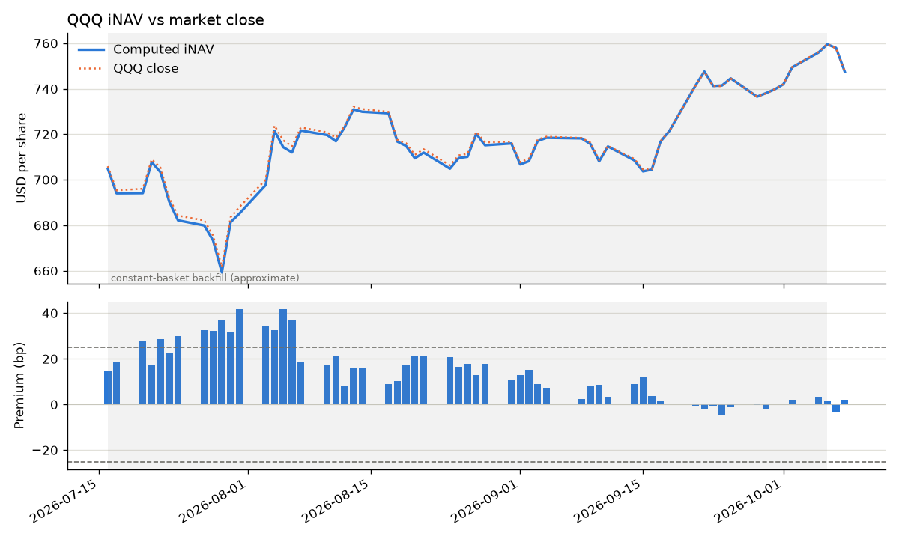

# QQQ iNAV Monitor

Rebuilds the **indicative net asset value (iNAV)** of the Invesco QQQ ETF from its published holdings, compares it with the market price, and runs data-quality checks on every step. A free GitHub Actions job runs it each weekday after the US close and commits the results back here, so this page is the dashboard. There's no server or hosting to set up.

## Latest run

<!-- latest:start -->
_Updated automatically by the daily job. Last run: 2026-10-09 02:34:29 UTC_



| Valuation date 2026-10-08 | |
|---|---|
| Computed iNAV | $747.42 |
| QQQ close | $747.58 |
| Premium / discount | +2.1 bp |
| Official NAV (2026-10-07) | $757.96 |
| iNAV vs official NAV | n/a (NAV used to set shares outstanding) |
| Holdings as of | 2026-10-07 |
| Shares outstanding | 669,383,118 (source: nav) |
| Price coverage | 100.0% |

**Data-quality checks**

- ✅ All checks passed
<!-- latest:end -->

**Interactive dashboard:** [`docs/index.html`](docs/index.html) is a single file with the premium/discount chart (1W to 1Y range buttons and a slider) and the top-10 holdings. Download it and open it in a browser.

## Why

An ETF trades all day, but its NAV is only struck once, after the close. The iNAV (also called IOPV) fills that gap: it values the fund's holdings at current prices so market makers and investors can see whether the ETF is trading at a premium or discount to what it holds. This project builds a simplified, end-of-day version of that calculation from public data.

## How it works

```
Invesco holdings feed ──┐
                        ├─► value basket ─► iNAV ─► checks ─► SQLite ─► chart + README + HTML dashboard
Yahoo Finance closes ───┘
```

1. **Holdings.** Pulls QQQ's daily holdings from Invesco's public JSON feed (units of each stock, cash, index futures) and saves the raw file to `data/raw/` as an audit trail.
2. **Classification.** Each line is tagged by security type:
   - stocks and ADRs are priced at market;
   - cash and futures collateral are taken at face value;
   - futures notional and its "synthetic cash" offset cancel out, so both are excluded.
3. **Prices.** Pulls raw (not dividend-adjusted) daily closes for every holding and for QQQ itself, plus the issuer's NAV as reported by Yahoo.
4. **Shares outstanding.** There's no clean free source, so it's resolved in priority order, with the source recorded:
   1. a manual override in `config.yaml`;
   2. total value of the basket ÷ official NAV, when the NAV is for the holdings date;
   3. Yahoo's figure, only if it is within 0.5% of the implied value;
   4. implied from the holdings-date close (assumes no premium that day).
5. **iNAV.** `(Σ units × close + cash) / shares outstanding`, for every trading day from the holdings date onward.
6. **Checks.** Flags anything that would make the number untrustworthy (see below).
7. **Storage and outputs.**
   - Everything goes into `data/inav.db` (SQLite), with a CSV copy so changes show in git diffs.
   - `docs/chart.png` and the "Latest run" section above are regenerated.
   - `docs/index.html` is a self-contained interactive dashboard.

## Data-quality checks

| Check | What it catches |
|---|---|
| `missing_price` | A holding with no close today (critical if weight ≥ 0.5%) |
| `large_move` | A stock moving ≥ 15% since the holdings date, which may be a split or corporate action that invalidates the units |
| `weights_sum` | Equity + cash weights not summing to ~100% |
| `tna_reconciliation` | Our valuation disagreeing with the total assets implied by the issuer's own weights |
| `stale_holdings` | Holdings file more than 5 days old |
| `official_nav` | Yahoo's NAV can't be matched to a single recent close, so it's not used |
| `shares_out_source` | Yahoo's shares outstanding inconsistent with the holdings, so it is rejected |
| `premium` / `nav_error` | Premium/discount or gap to official NAV beyond the threshold |

Thresholds live in `config.yaml`.

## What the real data showed

Things that came up when running against live data, and how the code handles them:

- **Yahoo's NAV isn't dated, and it isn't consistent.** On the same evening, my laptop got Oct 7's NAV and the GitHub runner got Oct 6's. Comparing it with today's iNAV produced a false 140 bp "error". The code now dates the NAV by matching it to the recent close it's nearest to. ETFs trade within a few bp of NAV while daily moves are ~100 bp, so the right day stands out, and the NAV is skipped when it doesn't.
- **Yahoo drops tickers.** A GitHub Actions run got no prices for CSCO (1.9% of the fund). The checks flagged it as critical, and missing tickers are now retried on their own.
- **Yahoo's shares outstanding is stale.** It reported 393M shares against roughly 670M implied by the holdings. The NAV-based figure takes priority, and when there isn't one the consistency check rejects Yahoo's number.
- **The backfill drifts.** History is valued with today's basket, so going back two months the premium creeps up to ~40 bp. That's the basket changing (dividends paid out, the quarterly rebalance), not a real premium. It's shaded on the charts, and daily runs replace it going forward.

## Run it locally

```bash
python -m venv .venv && source .venv/bin/activate
pip install -r requirements.txt
pytest -q                          # unit tests, no network needed
python -m inav backfill --days 60  # seed history, then build the outputs
python -m inav daily               # today's run + outputs
open docs/index.html
```

## Automation (free)

`.github/workflows/daily.yml` runs on GitHub Actions (free for public repos) at 22:30 UTC each weekday. It runs the tests, calculates the iNAV, and commits `data/`, `docs/` and this README back to the repo. You can also start it by hand from the **Actions** tab ("Daily iNAV update" → "Run workflow").

## Project layout

```
inav/
  holdings.py   fetch + parse the issuer's holdings feed
  prices.py     Yahoo Finance closes and fund info
  calc.py       iNAV maths (pure functions, unit tested)
  checks.py     data-quality checks
  pipeline.py   orchestration: fetch -> value -> check -> store
  db.py         SQLite schema and upserts
  report.py     chart, README section and HTML dashboard
tests/          pytest suite with a real holdings snapshot as fixture
config.yaml     ticker, paths, thresholds
.github/workflows/daily.yml
```

## Limitations and next steps

- **End-of-day only.** A production iNAV is published every 15 seconds from real-time prices. The valuation step is already separate, so an intraday price source could be plugged in.
- **Holdings lag.** The feed is one to two business days behind, so creations, redemptions and rebalances in between are missed.
- **Dividends and fees.** Accrued dividends and the management fee are not modelled. Ex-dividend dates show up as small jumps in the premium.
- **Single currency.** QQQ is all USD. Extending to a fund with foreign holdings means adding FX conversion per position.
- **Futures.** Futures P&L since the holdings date is ignored. It is about 0.14% of assets, so under 0.2 bp per 1% market move.
- **NAV dating.** Matching Yahoo's NAV to the nearest close fails on flat days, when two closes are about equally near. The NAV is then skipped, and shares outstanding falls back to the close-implied figure. A dated NAV from the issuer would remove the guesswork.
