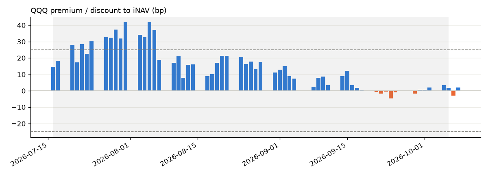

# QQQ iNAV

Rebuilds the value of the Invesco QQQ ETF from its daily holdings and compares it with the price QQQ actually closed at. The gap is the ETF's premium or discount. 
It runs for free on GitHub Actions every weekday after the US close and updates this page.

<!-- latest:start -->
**As of October 8, 2026**

| iNAV | QQQ close | Premium / discount | Official NAV |
|---|---|---|---|
| $747.42 | $747.58 | +2.1 bp | $757.96 (2026-10-07) |



<details><summary>Top 10 holdings</summary>

| Ticker | Weight | Close | Move | Contrib. |
|---|---|---|---|---|
| NVDA | 8.46% | $230.48 | -2.94% | -24.9 bp |
| AAPL | 7.26% | $340.42 | +1.11% | +8.1 bp |
| MSFT | 5.81% | $522.61 | -1.35% | -7.8 bp |
| MU | 5.01% | $1,035.84 | -4.79% | -24.0 bp |
| AMD | 4.30% | $620.68 | -3.90% | -16.8 bp |
| AMZN | 4.14% | $254.06 | -2.25% | -9.3 bp |
| META | 3.17% | $720.89 | -0.06% | -0.2 bp |
| GOOGL | 3.04% | $348.29 | -0.63% | -1.9 bp |
| SPCX | 2.93% | $160.57 | -4.19% | -12.3 bp |
| TSLA | 2.93% | $375.00 | -0.74% | -2.2 bp |

</details>
<!-- latest:end -->

Dashboard with a zoomable chart: download [`output/index.html`](output/index.html) and open it in a browser.

## How it works

1. Download QQQ's holdings from Invesco: the number of shares it owns of each stock, plus cash.
2. Get each stock's closing price from Yahoo Finance.
3. **iNAV** = (Σ shares × close + cash) ÷ QQQ shares outstanding.
4. **Premium / discount** = QQQ close vs iNAV, in basis points.
5. Run a few data checks (missing prices, possible stock splits, a valuation that doesn't reconcile with Invesco's weights), save everything to SQLite, and rebuild the dashboard and this page.

## Run it

```bash
pip install -r requirements.txt
python inav.py backfill --days 60   # build some history
python inav.py daily                # today's run
open output/index.html
```

## Notes

- End of day only. Real iNAVs are published every 15 seconds from live prices.
- There's no free source for shares outstanding (Yahoo's was 40% off), so it's backed out from the official NAV on the holdings date.
- The shaded history is valued with today's holdings, so it drifts the further back it goes.
